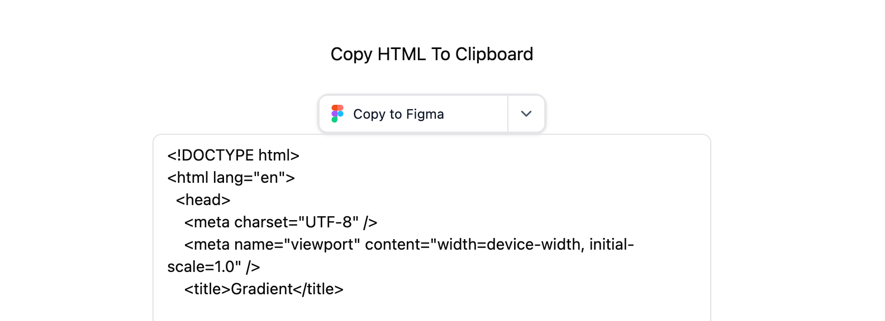

# @refore/copy-to-design-sdk

Import HTML pages into design tools like Figma via copy and paste.



## Run Example

Run vue example locally:

1. copy ./example/vue/.env.sample to ./example/vue/.env
2. replace <YOUR_KEY_HERE> in ./example/vue/.env
3. run command:

```bash
pnpm i
pnpm vue-example:dev
```

## Install SDK

```bash
pnpm i @refore/copy-to-design-sdk
```

## Use SDK

```typescript
import { CopyToDesign, PlatformType } from '@refore/copy-to-design-sdk';

const copyToDesign = new CopyToDesign({
  key: '<YOUR_KEY>',
});

const html = `<!DOCTYPE html>
<html lang="en">
  <body>
    Here is my content
  </body>
</html>
`;

await copyToDesign.copyToClipboardFromHTML(html, {
  width: 1920,
  height: 1080,
  platform: PlatformType.Figma,
});

alert('Copy successful. You can now paste it into the plugin.');
```
